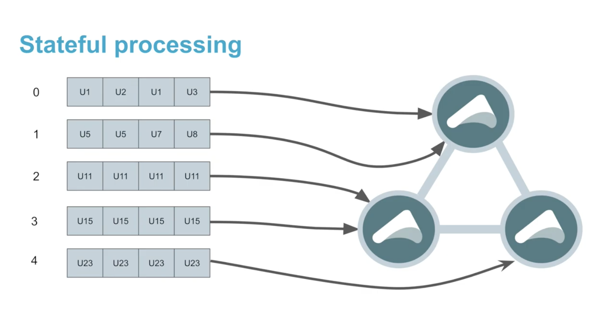

## Pekko Cluster Sharding Cloudflow Application

### Problem Definition

This project clusters a set of Pekko Streamlets to demonstrate how to leverage
Pekko Cluster Sharding for stateful stream processing in Cloudflow



### Sub projects

This application consists of the following sub-projects:

* `pekko-connected-car`: Contains the blueprint
* `pekko-connected-car-streamlet`: Pekko Streams based generator, cluster streamlet, and logger
* `datamodel`: Contains the Avro schema

### Example Deployment example on GKE

**Steps:**

* Make sure you have installed a GKE cluster with Cloudflow running.
Make sure you have access to your cluster:

```bash
$ gcloud container clusters get-credentials <CLUSTER_NAME>
```

and that you have access to the Google docker registry:

```bash
$ gcloud auth configure-docker
```

* Add the Google docker registry to your sbt project (should be adjusted to your setup). The following lines should be there in the file `target-env.sbt` at the root of your application. e.g.

```
ThisBuild / cloudflowDockerRegistry := Some("eu.gcr.io")
ThisBuild / cloudflowDockerRepository := Some("my-awesome-project")
```

`my-awesome-project` refers to the project ID of your Google Cloud Platform project.

* Build the application:

```bash
$ sbt buildApp
```

At the very end you should see the application image built and instructions for how to deploy it:

```
[info] Successfully built and published the following image:
[info]   docker.io/lightbend/pekko-connected-car-streamlet:467-26acd87-dirty
[success] Cloudflow application CR generated in /Users/myuser/lightbend-repos/cloudflow/examples/connected-car-cluster-sharding/target/connected-car-pekko-cluster.json
[success] Use the following command to deploy the Cloudflow application:
[success] kubectl cloudflow deploy /Users/myuser/lightbend-repos/cloudflow/examples/connected-car-cluster-sharding/target/connected-car-pekko-cluster.json
[success] Total time: 45 s, completed Jun 16, 2020 9:20:10 AM
```

* Make sure you have the `kubectl cloudflow` plugin configured.

```bash
$ kubectl cloudflow help
This command line tool can be used to deploy and operate Cloudflow applications.
...
```

* Deploy the app using the command mentioned in the output above:

```bash
$ kubectl cloudflow deploy /Users/myuser/lightbend-repos/cloudflow/examples/connected-car-cluster-sharding/target/connected-car-pekko-cluster.json
[Done] Deployment of application `connected-car-pekko-cluster` has started.
```

*  Verify it is deployed correctly.

```bash
$ kubectl cloudflow list

NAME                       NAMESPACE                  VERSION           CREATION-TIME
connected-car-pekko-cluster connected-car-pekko-cluster 221-65c1693-dirty 2020-04-14 22:35:44 -0500 CDT
```

* Check all pods are running.

```bash
$ kubectl cloudflow list

NAME                       NAMESPACE                  VERSION           CREATION-TIME
connected-car-pekko-cluster connected-car-pekko-cluster 221-65c1693-dirty 2020-04-14 22:35:44 -0500 CDT
nolangrace@nolans-MBP-2 ~ $ kubectl cloudflow status connected-car-pekko-cluster
Name:             connected-car-pekko-cluster
Namespace:        connected-car-pekko-cluster
Version:          221-65c1693-dirty
Created:          2020-04-14 22:35:44 -0500 CDT
Status:           Running

STREAMLET         POD                                                     READY             STATUS            RESTARTS
car-cluster       connected-car-pekko-cluster-car-cluster-5695d7bbc6-czrlh 1/1               Running           0
car-data          connected-car-pekko-cluster-car-data-78b469856d-csx9b    1/1               Running           0
car-printer       connected-car-pekko-cluster-car-printer-864b9d675b-6hrzj 1/1               Running           0
```

* Verify the application output.

```bash
$ kubectl -n connected-car-pekko-cluster logs -f connected-car-pekko-cluster-car-cluster-5695d7bbc6-czrlh
...
[INFO] [04/15/2020 03:36:27.391] [pekko_streamlet-pekko.actor.default-dispatcher-15] [pekko.tcp://pekko_streamlet@10.28.5.30:2551/system/sharding/Counter/1/10001001] Updated CarId: Car-10001001 Driver Name: Duncan CarSpeed: 60.0 From Actor:pekko://pekko_streamlet/temp/$I
[INFO] [04/15/2020 03:36:28.423] [pekko_streamlet-pekko.actor.default-dispatcher-21] [pekko.tcp://pekko_streamlet@10.28.5.30:2551/system/sharding/Counter/8/10001008] Updated CarId: Car-10001008 Driver Name: Hywel CarSpeed: 81.0 From Actor:pekko://pekko_streamlet/temp/$J
[INFO] [04/15/2020 03:36:29.454] [pekko_streamlet-pekko.actor.default-dispatcher-3] [pekko.tcp://pekko_streamlet@10.28.5.30:2551/system/sharding/Counter/8/10001008] Updated CarId: Car-10001008 Driver Name: Hywel CarSpeed: 64.0 From Actor:pekko://pekko_streamlet/temp/$K
[INFO] [04/15/2020 03:36:30.387] [pekko_streamlet-pekko.actor.default-dispatcher-17] [pekko.tcp://pekko_streamlet@10.28.5.30:2551/system/sharding/Counter/5/10001005] Updated CarId: Car-10001005 Driver Name: David CarSpeed: 60.0 From Actor:pekko://pekko_streamlet/temp/$L
[INFO] [04/15/2020 03:36:31.413] [pekko_streamlet-pekko.actor.default-dispatcher-21] [pekko.tcp://pekko_streamlet@10.28.5.30:2551/system/sharding/Counter/5/10001005] Updated CarId: Car-10001005 Driver Name: David CarSpeed: 81.0 From Actor:pekko://pekko_streamlet/temp/$M
[INFO] [04/15/2020 03:36:32.433] [pekko_streamlet-pekko.actor.default-dispatcher-15] [pekko.tcp://pekko_streamlet@10.28.5.30:2551/system/sharding/Counter/2/10001002] Updated CarId: Car-10001002 Driver Name: Kiki CarSpeed: 61.0 From Actor:pekko://pekko_streamlet/temp/$N
[INFO] [04/15/2020 03:36:33.387] [pekko_streamlet-pekko.actor.default-dispatcher-17] [pekko.tcp://pekko_streamlet@10.28.5.30:2551/system/sharding/Counter/5/10001005] Updated CarId: Car-10001005 Driver Name: David CarSpeed: 86.0 From Actor:pekko://pekko_streamlet/temp/$O
[INFO] [04/15/2020 03:36:34.403] [pekko_streamlet-pekko.actor.default-dispatcher-21] [pekko.tcp://pekko_streamlet@10.28.5.30:2551/system/sharding/Counter/3/10001003] Updated CarId: Car-10001003 Driver Name: Trevor CarSpeed: 79.0 From Actor:pekko://pekko_streamlet/temp/$P
[INFO] [04/15/2020 03:36:35.433] [pekko_streamlet-pekko.actor.default-dispatcher-21] [pekko.tcp://pekko_streamlet@10.28.5.30:2551/system/sharding/Counter/1/10001001] Updated CarId: Car-10001001 Driver Name: Duncan CarSpeed: 90.0 From Actor:pekko://pekko_streamlet/temp/$Q
```

Scale Cluster Streamlet
```bash
$ kubectl cloudflow scale connected-car-pekko-cluster car-cluster 3
```

* Undeploy.

```bash
$ kubectl cloudflow undeploy connected-car-pekko-cluster
```
